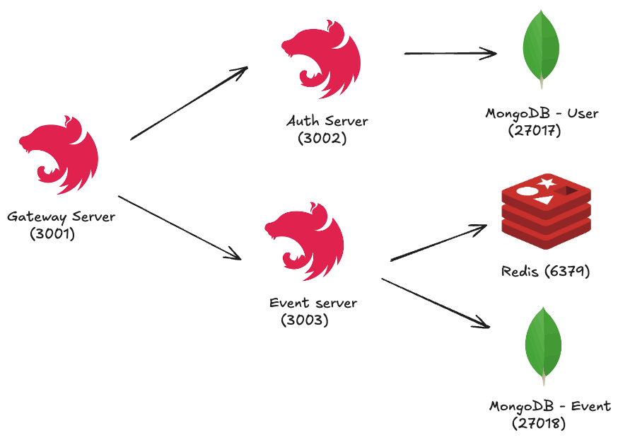

# nexon-maple-2025-assignment

넥슨 메이플 집중채용 - 메이플스토리 PC 백엔드 과제입니다.

### 디렉토리 구조

```
.
├── apps
│   ├── auth-server # 인증 서버
│   ├── event-server # 이벤트 서버
│   └── gateway-server # 게이트웨이 서버
├── docker-compose.yml
├── docs
│   ├── api
│   ├──── README.md # API 문서
└── test-files # API, 동시성 테스트 시 사용한 파일 모음 디렉토리
    ├── concurrency-test.js
    ├── event-api-test.http
    ├── README.md
    └── user-api-test.http
```

### 서버 실행 방법 및 유의사항

**Gateway Server PORT는 `3001`번으로 설정되어 있습니다.** API 테스트 시 `3001`번으로 요청을 보내야 합니다.

- Gateway Server: `3001`
- Auth Server: `3002`
- Event Server: `3003`
  ㅎ

```shell
$ docker-compose up -d
```

### 테스트 코드 실행

각 서버별 프로젝트 폴더로 이동하여, `npm test` 명령어를 실행합니다. npm 명령어가 있어야 합니다.

```shell
$ cd apps/event-server/

$ npm test # 테스트 실행
```

### 서버 및 데이터베이스 구성

포트는 [docker-compose.yml](./docker-compose.yml) 파일 기준입니다.



- Gateway Server: 모든 요청 라우팅
- Auth Server: 인증, 유저 관련 요청 처리
- Event Server: 이벤트, 보상 관련 처리

### API 문서 및 테스트 시 사용한 파일

- [API 문서](docs/api.md)
- API 테스트 / 동시성 테스트 시에 사용한 파일은 [test-files](./test-files) 디렉토리를 확인해주세요.

### 프로젝트 중점 사항

- 자주 변경될 수 있는 부분에 한하여 인터페이스 추출
    - PasswordEncoder, EventPublisher, ...
- 핵심 도메인 로직에 대한 단위 테스트 케이스 작성
    - [event-entity.spec.ts](./apps/event-server/test/event/event-entity.spec.ts)
- NoSQL 철학에 따른 데이터 중복 허용을 고려하여 스키마 설계
- [K6 Script](test-files/concurrency-test.js)를 활용하여 동시성 이슈 테스트
- Redis로 스로틀링 기능 구현하여 중복 요청 방지 ([PR #18](https://github.com/jxmen/nexon-maple-2025-assignment/pull/18))
- [NestJS Interceptor](https://docs.nestjs.com/interceptors) 기능을 사용하여 관심사
  분리 ([PR #19](https://github.com/jxmen/nexon-maple-2025-assignment/pull/19))

### 개발/설계를 하면서 했던 고민들 정리

- [동시성 이슈에 대해 정리한 문서](./docs/concurrency-control.md)
- NoSQL의 경우 데이터 중복을 허용한다. 데이터 내용 변경 시 일관성을 어떻게 유지할 것인지

### 회고

좋았던 점

- MSA 구조에 대해 어느 정도 익숙해진 점
- Spring Framework에 익숙하여, NestJS도 필요한 기능은 빠르게 찾아 구현한 점

아쉬웠던 점

- 통합 테스트 코드를 많이 작성하지 못한 점
- monorepo를 처음에 도입하지 못했던 것
    - gateway와 타 서버 통신 시 서로 공유하는 코드를 가지고 있지 않아, request/response를 2번씩 정의해야 하는 번거로움이 있었습니다.
    - 하지만 다음에 Nest 프로젝트를 한다면 더 체계적으로 준비하여 프로젝트를 진행할 수 있을 것 같습니다.
- 이벤트 조건을 다양하게 구현해보지 못한 것
    - 친구 초대, N번 로그인 등 다양한 가상의 이벤트를 만들어 보면 재밌었을 것 같은데, 해보지 못해 아쉬웠습니다.

### 시간이 더 있다면 했을 것들

- [ ] 전체 목록 조회 API들 페이지네이션 기능 지원
- [ ] 이벤트 조건 다양한 케이스 추가 (예: 친구 초대, N번 로그인)
- [ ]  API 고도화
    - [ ]  이벤트 상세 조회 시, 보상도 같이 조회
    - [ ]  보상 요청 내역에 이벤트 이름도 같이 쌓기
- [ ]  mongodb 시간 관련 컬럼 스네이크 케이스로 변경
- [ ]  통합 테스트 코드 작성
- [ ]  monorepo 프로젝트로 변경
