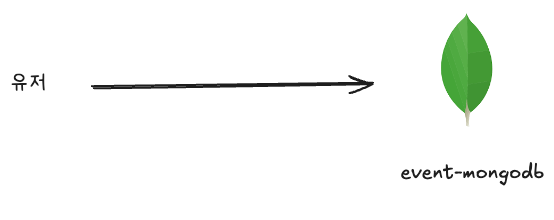
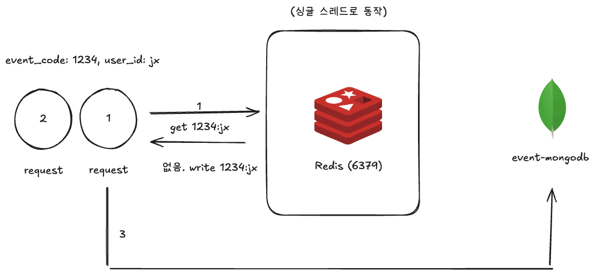
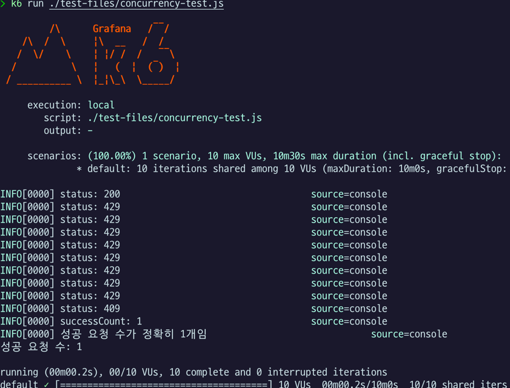
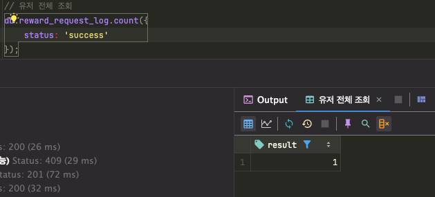

# 동시성 이슈

'보상 요청' API를 개발하면서, 중복 요청에 대한 동시성 이슈를 반드시 해결해야 한다고 느꼈다.

보상 요청 로직은 대략적으로 다음과 같다.

1. 보상 요청 내역에서 event_code, user_id에 대해 status:success가 없어야 함
2. event_code가 존재하는지 확인
3. 이벤트가 시작 후인지
4. 이벤트가 종료 전인지
5. 이벤트가 활성화 상태인지
6. 유저가 이벤트 조건을 충족하지 않았는지

등등의 과정이 존재한다. 여기서 모든 조건을 만족한다면, 보상 요청 내역에도 'success' 상태의 내역을 저장할 것이다.

하지만 문제는 내역을 쌓기 전에, 다른 요청이 1번 로직을 지나 그대로 모든 조건을 만족한다면, 또 다른 'success' 상태가 생길 것이다.

### redis의 싱글 스레드와 setNX

우선 '보상 요청' 기능이라는 것 자체에 집중해보자. 사용자가 '따닥'하고 눌렀을 때 문제가 되는 것이다. 트래픽이 엄청나게 폭증하는 것이 아니다.

그래서 한번에 많은 요청이 들어올 때 요청을 제한하는 rate limit를 구현하면 어떨까? 하는 생각이 들었다. nestjs에서도 [rate-limiting](https://docs.nestjs.com/security/rate-limiting)으로 별도의 문서와 함께 사용법을 알려주고 있었으나, API 별로 제한하는 것은 가능하지만 나의 경우 이야기가 달랐다.

사용자1과 사용자2가 동시에 한번씩 누르는 것과는 다르다. 유저 별로 rate limit를 구현할 수 있는 방법이 어떤 것이 있을까 하다가 redis를 떠올리게 되었다.

생각한 방식은 다음과 같았다.

1. 1번 요청이 redis에 먼저 접근한다. 키 값은 `event_code:user_id` 형태로 조회한다.
2. 없다면 해당 키를 redis에 추가한다.
3. 1번 요청은 이후 mongodb를 조회하여 검증 로직을 수행한다.
4. 2번 요청이 들어왔으나 키값이 redis에 있다. mongodb로 가지 않고 바로 종료된다.

1번 요청은 mongodb를 조회하고, 이후 비즈니스 로직이 맞는지 검증할 것이다. 아니라면 4xx에러가 발생할 것이다.

만약 ttl이 만료되어 다음 3,4,5번 요청이 한번에 들어온다면, 3번만 비즈니스 로직을 수행하게 될 것이다. 3번 요청이 이벤트 조건을 충족할 경우, success로 요청 내역을 쌓는다. 이렇게 요청 내역은 성공 1건에 실패 4건으로 기록된다.

redis에서 set() 명령어 중 'NX' 옵션을 넣으면, set을 할때 키 값이 있으면 실행하지 않고 null을 반환한다. 이를 통해 임계 영역처럼 사용이 가능해진다.

### K6 테스트 실행 결과

K6라는 툴을 사용하면 동시에 여러 요청을 보낼 수 있다. 1건만 http 요청이 완료되길 기대하도록 작성하였고, 정상적으로 잘 동작한다.

- (http status code 200이 1개만 된 모습)

mongodb에서도 success가 1건만 조회되는 것을 확인할 수 있다.

### redis가 오히려 단일 장애 지점이 되진 않을까?

현재 상태로는 그런 것 같다. (아직 fallbak 로직은 따로 넣지 못함)

하지만 그렇다고 또 redis cluster, redlock등을 쓰자니 운영 비용과 복잡도가 크게 증가한다. 현재 상황에서는 그나마 쉽게 구현이 가능해서 이것도 장점이 있는 것 같다.

### 다른 대안은 없었을까?

mongodb의 락도 대안이 될 수도 있을 것 같았으나, 아직 mongodb에 익숙하지 않아 그나마 몇번 써본 적이 있는 redis를 사용했다.

### 관련 파일

- [test-files/concurrency-test.js](../test-files/concurrency-test.js)

### 관련 PR

- Redis로 동시성 이슈 해결 - [#18](https://github.com/jxmen/nexon-maple-2025-assignment/pull/18)
- NestJS 인터셉터로 리팩토링 - [#19](https://github.com/jxmen/nexon-maple-2025-assignment/pull/19)
